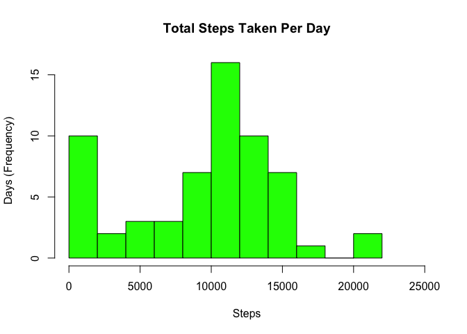
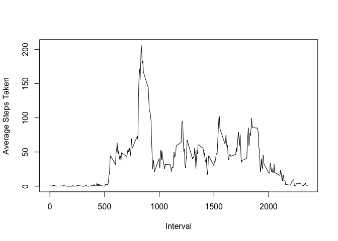
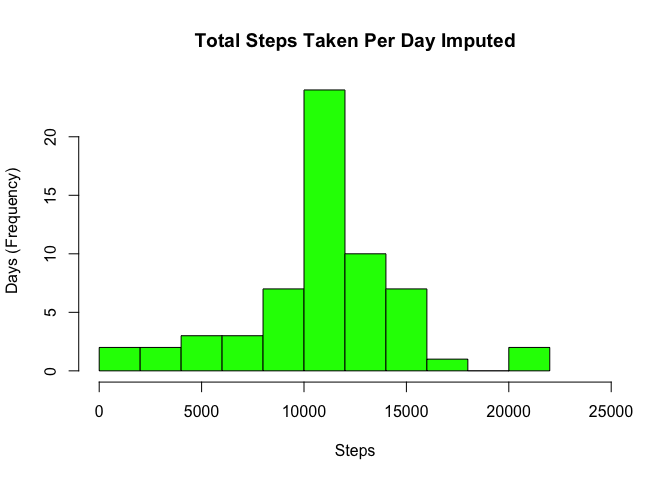

# Reproducible Research: Peer Assessment 1

## Basic config set up and library loading.


```r
options(scipen=999)

library(ggplot2)
```

##Step 1. Load and process the activity monitoring dataset.

Load the activity data from the extracted csv file.


```r
data <- read.csv("activity.csv")
```

Process the date column to ensure its of class 'Date'; we'll need this for the last plot.


```r
data$date <- as.Date(as.character(data$date), format = "%Y-%m-%d")
```


##Step 2. Histogram of the total number of steps taken each day.

First we calculate total test per day, and then simply display the result in a histogram.


```r
total_steps <- tapply(data$steps, data$date, sum, na.rm=TRUE)

hist(total_steps, breaks=12, col="green", main="Total Steps Taken Per Day", xlab="Steps", ylab="Days (Frequency)", xlim=c(0,25000))
```

<!-- -->

##Step 3. Mean and median number of steps taken each day.

First calculate the mean/medium steps.


```r
mean_total_steps <- mean(total_steps, na.rm=TRUE)

median_total_steps <- median(total_steps,na.rm=TRUE)
```

Shown below are the results!

Mean total steps = 9354 <br/>

Median total steps = 10395


##Step 4. Time series plot of the average number of steps taken

We'll use aggregate to calculate the average number of steps, supplying the 'mean' function as an arguement.

```r
average_steps <- aggregate(steps ~ interval, data, mean, na.rm=TRUE)

plot(average_steps$interval, average_steps$steps, type="l", ylab="Average Steps Taken", xlab="Interval")
```

<!-- -->

##Step 5. Identify / display the 5 minute interval with most steps.

```r
max <- which.max(average_steps$steps)

interval_with_max <- average_steps[max,'interval']
```

The interval with the most steps is 835.

##Step 6. Implement strategy for dealing with missing values.

The strategy selected to fill in missing values, is to use the average for the respective interval.


```r
imputed_data <- data

for (i in 1:length(imputed_data[, 1]))
{
    if (is.na(imputed_data[i,1]))
    {
       imputed_data[i,1] <- (average_steps[average_steps$interval == imputed_data[i,3],"steps"])
    }
}
```

##Step 7. Histogram of total steps taken based on imputed data.

First recalculate the total steps (based on imputed data) and then display in a new histogram.


```r
imputed_total_steps <- tapply(imputed_data$steps, imputed_data$date, sum, na.rm=TRUE)

hist(imputed_total_steps, breaks=12, col="green", main="Total Steps Taken Per Day Imputed", xlab="Steps", ylab="Days (Frequency)", xlim=c(0,25000))
```

<!-- -->

Now let's see the impact on mean/median once missing data is imputed.


```r
imputed_mean_total_steps <- round(mean(imputed_total_steps))

imputed_median_total_steps <- round(median(imputed_total_steps))
```

Using imputed data, our mean and median results are consistent with each other. 

However, there is clearly an important difference between our earlier results in step 3.

Mean total steps = 10766 <br/>

Median total steps = 10766

##Step 8. Compare avg number of steps per interval by day category.

1. Categorise dates in the data set as either 'weekday' or 'weekend'.

  We'll add this categorization to our imputed data using the function / code below.


```r
is_weekend <- function(date)
{
  if(weekdays(date) == "Saturday" | weekdays(date) == "Sunday")
    return("weekend") 

  return("weekday")
}

imputed_data$day_category <- sapply(imputed_data$date, FUN=is_weekend)
```

2. Calculate the 'mean' steps taken based on 'interval' AND 'day_category' in a panel plot.


```r
data_by_day_category <- aggregate(steps ~ interval + day_category, imputed_data, mean)

ggplot(data_by_day_category, aes(interval, steps)) +  geom_line() + 
    facet_grid(day_category ~ .) +
    xlab("Interval") + 
    ylab("Number of Steps")
```

<!-- -->
