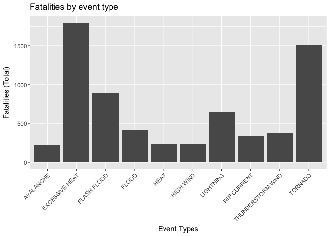
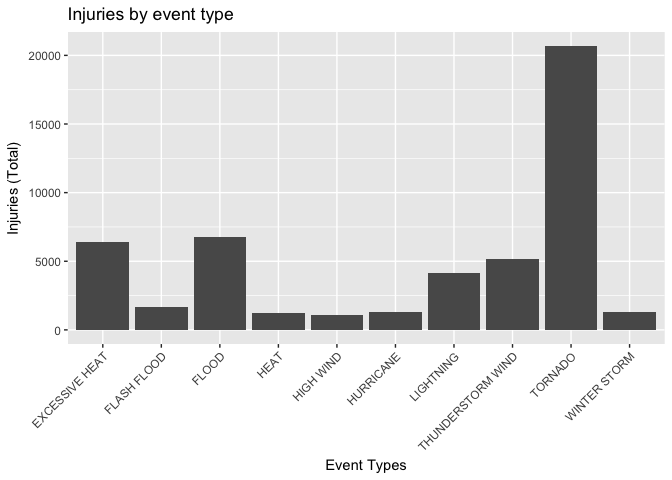
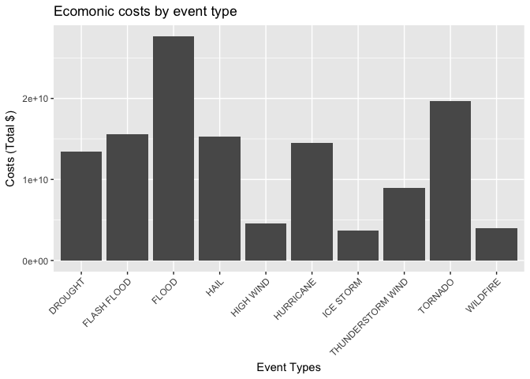

# Storms: Their public health and economical impact.
<br/>

## Synopsis

Across the United States, we recognize severe weather events can cause both public health and economic problems. 

This report utlizes data collected by the U.S. National Oceanic and Atmospheric Administration's (NOAA); aka it's 'storm database'.

This database tracks storms/major weather events in the United States, providing estimates of fatalities, injuries, and property damage.


More detailed information on the storm database (and it's characteristics) can be found [here](https://d396qusza40orc.cloudfront.net/repdata%2Fpeer2_doc%2Fpd01016005curr.pdf]).


## Data Processing 

<br/>
1. **Get a copy of the storm database**


```r
download_data <- function(url, file_name)
{
    if (!file.exists(file_name))
    {
        download.file(url, file_name)
    }
}

get_data <- function()
{
    file_name <- "StormData.csv.bz2"
    
    download_data("https://d396qusza40orc.cloudfront.net/repdata%2Fdata%2FStormData.csv.bz2",file_name)
  
    data <- read.csv(bzfile(file_name))
}

data <- get_data()
```

The code snippet above downloads the storm database from [here](https://d396qusza40orc.cloudfront.net/repdata%2Fdata%2FStormData.csv.bz2).

The downloaded file is in 'bz2' format; R allows us to unpack the file ('csv') into our current working directory. 

<br/>
2. **Isolate the data needed for the analysis**


```r
get_relevant_data <- function(raw_data)
{
  raw_data$BGN_DATE <- as.Date(as.character(raw_data$BGN_DATE), format = "%m/%d/%Y")
  
  relevant_data <- subset(raw_data, format.Date(BGN_DATE, "%Y") >= "1996")
  
  relevant_data <- relevant_data[,c('BGN_DATE','EVTYPE','FATALITIES','INJURIES',
                                    'PROPDMG','PROPDMGEXP','CROPDMG','CROPDMGEXP')]
}

report_data <- get_relevant_data(data)
```

This report focus' on data collected from the year 1996 onwards. 

By focusing on this period, it is hoped to avoid biasing analysis results by excluding 
  
periods where some event types were not consistency collected.
  
As the intended analaysis requires a small subset of the attributes in the database; we'll subset the data including only the needed columns.

<br/>
3. **Perform some basic data clean up**


```r
clean_evtype <- function(value)
{
  value <- toupper(value)

  value <- gsub("TSTM", "THUNDERSTORM",value)
  
  value <- gsub("THUNDERSTORM WIND.*", "THUNDERSTORM WIND", value)
  
  value <- gsub("HURRICANE.*", "HURRICANE", value)
    
  value <- gsub("*HIGH SURF.*", "HIGH SURF", value)
  
  value <- gsub("  ", " ",value)

  value <- gsub("CSTL", "COASTAL", value)
  
  value <- sub("^\\s+","",value)
  
  value
}

report_data$EVTYPE <- sapply(report_data$EVTYPE, clean_evtype)
```

The EVTYPE attribute in the data file requires a great deal of rationalization/sanitization.

The code above does not attempt to address all issues, but provides some basic sanitization.

Issues addressed:

  - Dealing with unwanted white space
  - Using consistent 'case'
  - Correcting common spelling/abbreviated errors
  
<br/>
4. **Calculate economic impact of weather events**


```r
calculate_cost <- function(value, exp)
{
  exp <- toupper(exp)
  
  if (exp == 'K')
  {
      value <- value * 1000
  } 
  else if (exp == 'M'){
      value <- value * 1000000
  }
  else if (exp == 'B'){
      value <- value * 10000000
  }
  else
  {
    value <- 0
  }
}

calculate_economic_costs <- function(report_data)
{
    report_data$PROPDMG <- mapply(calculate_cost, report_data$PROPDMG, report_data$PROPDMGEXP)
 
    report_data$CROPDMG <- mapply(calculate_cost, report_data$CROPDMG, report_data$CROPDMGEXP)

    report_data$ECONOMICIMPACT <- report_data$PROPDMG+report_data$CROPDMG
    
    report_data
}

report_data <- calculate_economic_costs(report_data)
```

To calculate the economic cost's associated with weather events we:

1. Convert the individual costs entered to real dollar amounts.

2. Aggregate these costs over a particular EVTYPE.
<br/>

## Results

**What are the population health impacts associated with storm/weather events?**


```r
library(ggplot2)

show_fatalities_plot <- function(report_data)
{
  fatality_data <- aggregate(FATALITIES ~ EVTYPE, report_data, FUN=sum)
  
  fatality_data <- fatality_data[order(-fatality_data$FATALITIES),]
  
  fatality_data <- fatality_data[c(1:10),]

  ggplot(data=fatality_data, aes(x=EVTYPE,y=FATALITIES)) + 
    ggtitle("Fatalities by event type") +
    xlab("Event Types") +
    ylab("Fatalities (Total)") +
    geom_bar(stat = "identity") + 
    theme(axis.text.x=element_text(angle = 45, hjust = 1))
}

show_fatalities_plot(report_data)
```

<!-- -->

The graph above shows the leading (10) causes of fatalities associated with storm events.

It's clear excessive heat, tornado's and flooding are the leading factors in storm related fatalities.
</br>

```r
show_injuries_plot <- function(report_data)
{
  injury_data <- aggregate(INJURIES ~ EVTYPE, report_data, FUN=sum)
  
  injury_data <- injury_data[order(-injury_data$INJURIES),]
  
  injury_data <- injury_data[c(1:10),]

  ggplot(data=injury_data, aes(x=EVTYPE,y=INJURIES)) + 
    geom_bar(stat = "identity") + 
    ggtitle("Injuries by event type") +
    xlab("Event Types") +
    ylab("Injuries (Total)") +
    theme(axis.text.x=element_text(angle = 45, hjust = 1))
}

show_injuries_plot(report_data)
```

<!-- -->

The graph above shows the leading (10) causes of injuries.

Here we also see excessive heat, tornado's and flooding are the leading factors in storm related injuries.
<br/>
<br/>
**What are the economic impacts associated with storm/weather events?**


```r
show_economy_plot <- function(report_data)
{
  econ_impact_data <- aggregate(ECONOMICIMPACT ~ EVTYPE, report_data, FUN=sum)
  
  econ_impact_data <- econ_impact_data[order(-econ_impact_data$ECONOMICIMPACT),]
  
  econ_impact_data <- econ_impact_data[c(1:10),]

  ggplot(data=econ_impact_data, aes(x=EVTYPE,y=ECONOMICIMPACT)) + 
    geom_bar(stat = "identity") + 
    ggtitle("Ecomonic costs by event type") +
    xlab("Event Types") +
    ylab("Costs (Total $)") +
    theme(axis.text.x=element_text(angle = 45, hjust = 1))
}

show_economy_plot(report_data)
```

<!-- -->

Finally, we see the greatest economic costs are incurred by Flooding, Tornado's, Hail and Hurricanes.
